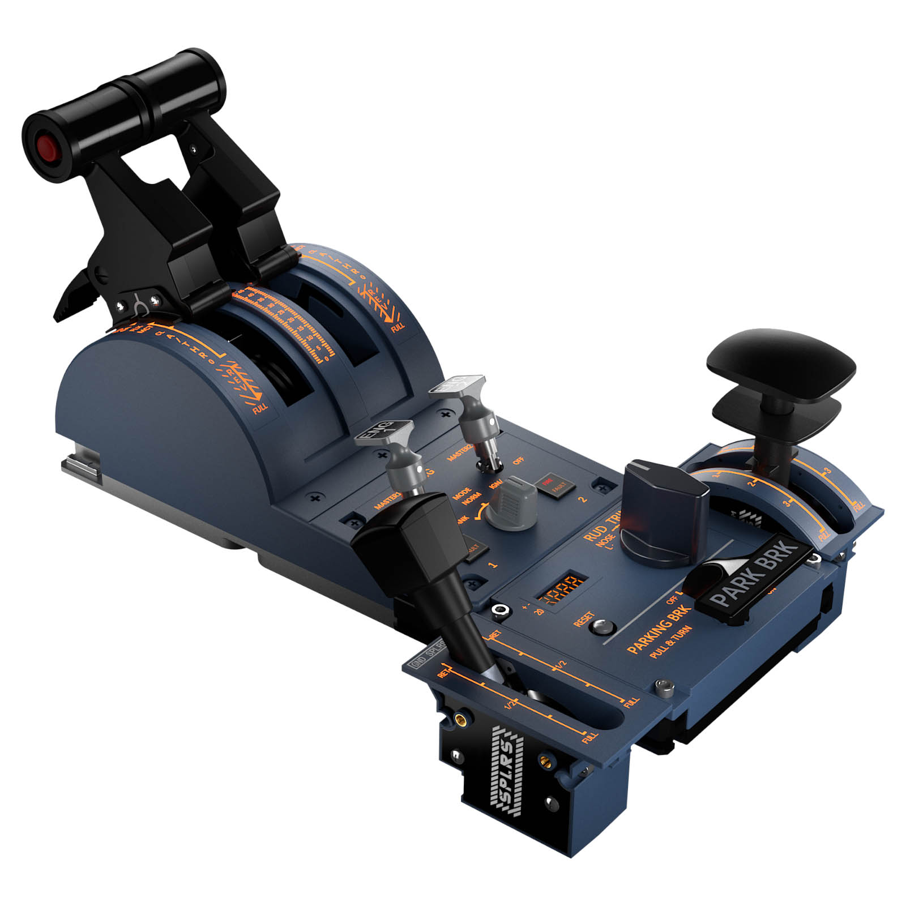

# URSA MINOR 32 - Reverse Engineering Project

Reverse engineering of the USB HID protocol for the **WINCTRL URSA MINOR 32 Throttle Metal / 32 PAC Metal** (Winwing) with updated firmware (PID 0xB920).




## Status: Complete

All three HID reports have been fully reverse engineered:

| Report | Purpose | Status |
|--------|---------|--------|
| 0x01 | Joystick (42 buttons + 4 axes) | Fully mapped |
| 0x02 | Auxiliary (4 backlights, 4 LEDs, 2 motors) | Fully mapped |
| 0xF0 | LCD display (7-segment trim values) | Fully decoded |

## Documentation

**[Docs/HID_Protocol_Reference.md](Docs/HID_Protocol_Reference.md)** - Complete protocol specification with byte-level details, encoding algorithms, and code examples for all three reports.


| Parameter | Value |
|-----------|-------|
| VID | 0x4098 |
| PID | 0xB920 (was 0xBB13 before firmware update) |
| Library | hidapi (`pip install hidapi`) |

## Project Structure

```
Docs/
  HID_Protocol_Reference.md   # Complete protocol documentation
scripts/
  tests/                       # Validation and control scripts
captures/                      # USB capture files (.pcapng)
```

## Credits

This project was reverse-engineered and documented with the assistance of **Antigravity** and **Claude CLI**.

